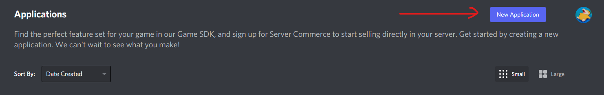
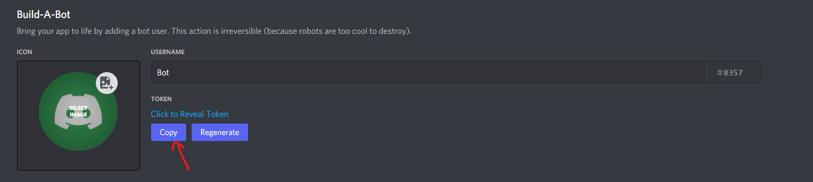
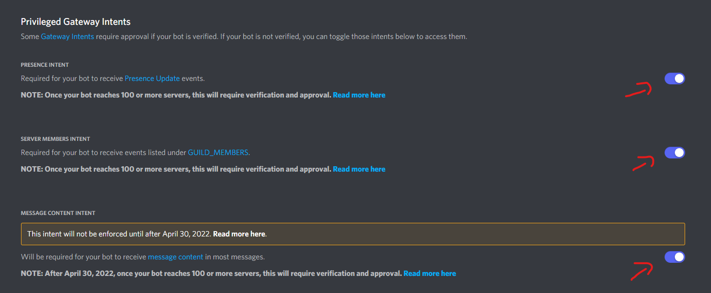
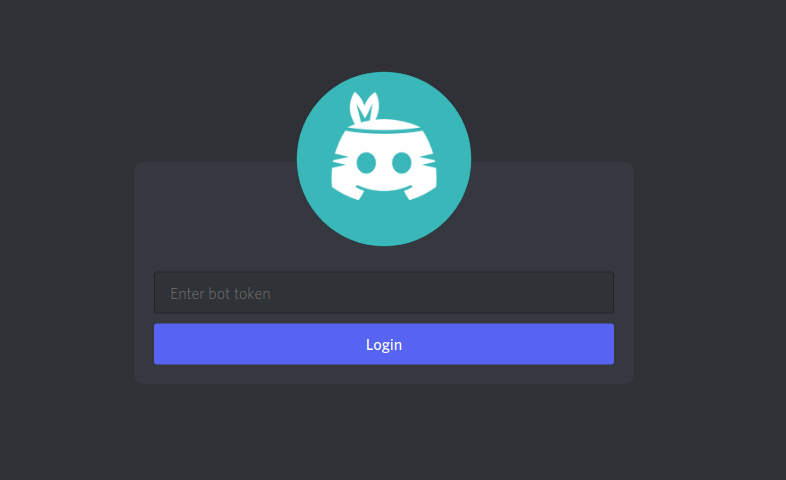
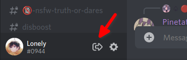

<div align="center">
  
# BotClient
  
**Login as a Discord Bot**
  
[](https://github.com/darkguy10/BotClient/blob/main/LICENSE)

[](#downloads)
  
[](https://discord.gg/aZSrxwNUFD)

</div>


**_Table of Contents_**

-   [BotClient](#botclient)
    -   [Description](#description)
    -   [Features](#features)
    -   [Downloads](#downloads)
    -   [Building from Source](#building-from-source)
    -   [Creating a Bot](#creating-a-bot)
    -   [Setting up BotClient](#setting-up-botclient)
    -   [Contributors ✨](#contributors-)

## Description

An unofficial client for logging in as a discord bot.\
**This project is not affliated with Discord in any way and I'm not responsible for any misuse.**

## Features

-   UI and workflow modelled after the original Discord client
-   Neatly built using React as frontend and powered by discord.js at core
-   Persistent token storage
-   Support for all major desktop platforms
-   Installable binaries with auto updates

## Downloads

Binaries for supported platforms can be found in the [Release Section](https://github.com/darkguy10/BotClient/releases/latest/)\
All binaries support auto-updates by default.

## Building from Source

The client can also be built from source for individual platforms.\
Make sure you have [Git CLI](https://git-scm.com/downloads), [NodeJS](https://nodejs.org/en/download/) and [Yarn](https://classic.yarnpkg.com/lang/en/docs/install) installed.

1. Clone the repository and cd into it

```
git clone https://github.com/DarkGuy10/BotClient.git
cd BotClient
```

2. Install required dependencies

```
yarn
```

3. Run the build script

```
yarn build
```

The compiled app is in the `dist/` folder.

## Creating a bot

If you already have a bot, skip this step.

1. Log into the Discord Developer Portal

2. Create a new application



3. Inside your application go to `Bot` section and create a new Bot. Click the "Copy" button to copy your bot's token and save it somewhere; you'll need this to login later. **Don't share it with anyone!**



4. Now Scroll down a bit to the `Privileged Gateway Intents` section and enable all three of them. Make sure to save afterwards.



Congrats! You're done setting up your own Discord Bot! ✨

## Setting up BotClient

**The botclient needs privileged gateway intents to be enabled, so make sure you have all three of them checked.**


Once you have downloaded and installed the client, simply run it from start menu or any app launcher.\
You should be prompted by a login screen, enter your bot's token in the field and hit Login.



You can logout using this _very obvious_ button here



Thats all there is to it! ✨\
Keep in mind that the project is still in early development and is bound to have bugs.\
If you have any problems or questions about the BotClient feel free to join our [support server](https://discord.com/invite/aZSrxwNUFD) on Discord.

## Contributors ✨

Thanks goes to these wonderful people ([emoji key](https://allcontributors.org/docs/en/emoji-key)):

<!-- ALL-CONTRIBUTORS-LIST:START - Do not remove or modify this section -->
<!-- prettier-ignore-start -->
<!-- markdownlint-disable -->
<table>
  <tr>
    <td align="center"><a href="https://promptfolio.vercel.app"><br /><sub><b>DarkGuy10</b></sub></a><br /><a href="https://github.com/DarkGuy10/BotClient/commits?author=DarkGuy10" title="Code">💻</a> <a href="https://github.com/DarkGuy10/BotClient/commits?author=DarkGuy10" title="Documentation">📖</a> <a href="#projectManagement-DarkGuy10" title="Project Management">📆</a></td>
    <td align="center"><a href="https://github.com/Duckulus"><br /><sub><b>Duckulus</b></sub></a><br /><a href="https://github.com/DarkGuy10/BotClient/commits?author=Duckulus" title="Documentation">📖</a></td>
    <td align="center"><a href="https://github.com/jerbear2008"><br /><sub><b>jerbear4328</b></sub></a><br /><a href="https://github.com/DarkGuy10/BotClient/commits?author=jerbear2008" title="Code">💻</a></td>
    <td align="center"><a href="https://github.com/ipxter"><br /><sub><b>pxter</b></sub></a><br /><a href="https://github.com/DarkGuy10/BotClient/issues?q=author%3Aipxter" title="Bug reports">🐛</a></td>
    <td align="center"><a href="https://github.com/SkyLayzer"><br /><sub><b>SkyLayzer</b></sub></a><br /><a href="#design-SkyLayzer" title="Design">🎨</a></td>
  </tr>
</table>

<!-- markdownlint-restore -->
<!-- prettier-ignore-end -->

<!-- ALL-CONTRIBUTORS-LIST:END -->

This project follows the [all-contributors](https://github.com/all-contributors/all-contributors) specification. Contributions of any kind welcome!
