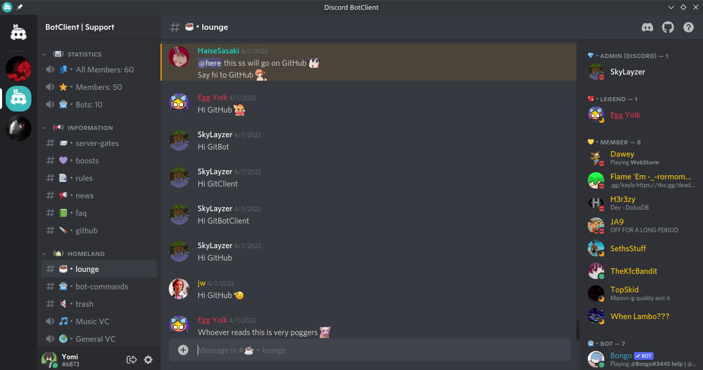

<h3 align="center">
	<br/>
	
	BOTCLIENT
	
</h3>

<h6 align="center">
  <a href="#-features">Features</a>
  ·
  <a href="#-downloads">Downloads</a>
  ·
  <a href="#-building-from-source">Building from Source</a>
  ·
  <a href="#-setting-up">Setting Up</a>
  ·
  <a href="#-faqs">FAQs</a>
</h6>

<p align="center">
	<a href="https://github.com/darkguy10/BotClient/stargazers">
		</a>
	<a href="https://github.com/darkguy10/BotClient/releases/latest">
		</a>
	<a href="#-downloads">
		</a>
	<a href="https://discord.com/invite/aZSrxwNUFD">
		</a>
</p>

&nbsp;

<p align="center">
  BotClient is an open-source client for logging in as a discord bot. It's built using Electron, giving it complete cross-platform support! In addition, it uses the powerful electron-updater module to provide auto-updates on all supported binaries. The project aims to be extremely expandable, so that new features and future updates can be easily added.
</p>

&nbsp;



&nbsp;

### ✨ Features

- UI and workflow modelled after the original Discord client
- Neatly built using React as frontend and powered by discord.js at core
- Persistent token storage
- Support for all major desktop platforms
- Installable binaries with auto updates

&nbsp;

### 📦 Downloads

<table>
  <tr>
    <th>
      Platform
    </th>
    <th>
      Binary Type
    </th>
    <th>
      Download Link
    </th>
  </tr>
  <tr> 
    <td>
      Windows
    </td>
    <td align="center">
      <code>NSIS installer</code>
    </td>
    <td>
      <a href="https://github.com/DarkGuy10/BotClient/releases/latest/download/BotClient-win-x64.exe">
        </a>
      </a>
    </td>
  </tr>
  <tr> <td>Linux</td>
    <td align="center"><code>.AppImage</code></td>
    <td>
      <a href="https://github.com/DarkGuy10/BotClient/releases/latest/download/BotClient-linux-x86_64.AppImage"></a>
    </td>
  </tr>
  <tr>
    <td>Mac</td>
    <td align="center"><code>.dmg</code></td>
    <td>
      <a href="https://github.com/DarkGuy10/BotClient/releases/latest/download/BotClient-mac-x64.dmg"></a>
    </td>
  </table>
  
All binaries support auto-updates.

Release notes for the latest release can be found [here](https://github.com/darkguy10/BotClient/releases/latest/).

&nbsp;

### 🔧 Building from Source

The client can also be built from source for individual platforms.

#### Prerequisites

- [Git CLI](https://git-scm.com/downloads)
- [NodeJS](https://nodejs.org/en/download/)
- [Yarn](https://classic.yarnpkg.com/lang/en/docs/install)

#### Building

1. Clone the repository and cd into it.

```
git clone https://github.com/DarkGuy10/BotClient.git
cd BotClient
```

2. Install required dependencies.

```
yarn install
```

3. Run the build script.

```
yarn build
```

The compiled app is in the `dist/` folder.

&nbsp;

### 🚀 Setting Up

#### Prerequisites

Your bot must have all three [Privileged Gateway Intents](https://discordjs.guide/popular-topics/intents.html#privileged-intents) enabled.

#### Logging in

Once you have downloaded and installed the client, simply run it from the start menu or any app launcher.

You should be prompted by a login screen, enter your bot's token and hit enter.

That's literally all there is to it! ✨ <br />
If you have any problems or questions about the client, feel free to join our [support server](https://discord.com/invite/aZSrxwNUFD) on Discord.

&nbsp;

### 📚 FAQs

- Q: I'm getting `[DISALLOWED_INTENTS]` error, how do I fix this?

  - A: Your bot must have all three [Privileged Gateway Intents](https://discordjs.guide/popular-topics/intents.html#privileged-intents) enabled.

- Q: The client is stuck on loading screen, how do I fix this?

  - A: This happens because of mis-configured appdata. Clear the client appdata by deleting your `%userprofile%\AppData\Roaming\BotClient` folder if you're on windows,`~/.config/BotClient` folder for linux or `~/Library/Application Support/BotClient` for mac.

- Q: Is there a website version of this client?

  - A: Nope, and there won't be one in the future, reasons being it's too much work and simply not worth it.

- Q: What about Android or iOS?
  - A: No support for mobile devices, and will never be added either.

&nbsp;

### 📜 License

<a href="https://github.com/darkguy10/BotClient/blob/main/LICENSE"></a>

BotClient is released under the MIT license, which grants the following permissions:

- Commercial use
- Distribution
- Modification
- Private use

For more convoluted language, see the [LICENSE](https://github.com/darkguy10/BotClient/blob/main/LICENSE).

&nbsp;

### 💝 Contributors

<a href="#-contributors"></a>

Thanks goes to these wonderful people ([emoji key](https://allcontributors.org/docs/en/emoji-key)):

<!-- ALL-CONTRIBUTORS-LIST:START - Do not remove or modify this section -->
<!-- prettier-ignore-start -->
<!-- markdownlint-disable -->
<table>
  <tr>
    <td align="center"><a href="https://promptfolio.vercel.app"><br /><sub><b>DarkGuy10</b></sub></a><br /><a href="https://github.com/DarkGuy10/BotClient/commits?author=DarkGuy10" title="Code">💻</a> <a href="https://github.com/DarkGuy10/BotClient/commits?author=DarkGuy10" title="Documentation">📖</a> <a href="#projectManagement-DarkGuy10" title="Project Management">📆</a></td>
    <td align="center"><a href="https://github.com/Duckulus"><br /><sub><b>Duckulus</b></sub></a><br /><a href="https://github.com/DarkGuy10/BotClient/commits?author=Duckulus" title="Documentation">📖</a></td>
    <td align="center"><a href="https://github.com/jerbear2008"><br /><sub><b>jerbear4328</b></sub></a><br /><a href="https://github.com/DarkGuy10/BotClient/commits?author=jerbear2008" title="Code">💻</a></td>
    <td align="center"><a href="https://github.com/ipxter"><br /><sub><b>pxter</b></sub></a><br /><a href="https://github.com/DarkGuy10/BotClient/issues?q=author%3Aipxter" title="Bug reports">🐛</a></td>
    <td align="center"><a href="https://github.com/SkyLayzer"><br /><sub><b>SkyLayzer</b></sub></a><br /><a href="#design-SkyLayzer" title="Design">🎨</a></td>
  </tr>
</table>

<!-- markdownlint-restore -->
<!-- prettier-ignore-end -->

<!-- ALL-CONTRIBUTORS-LIST:END -->

This project follows the [all-contributors](https://github.com/all-contributors/all-contributors) specification. Contributions of any kind welcome!
