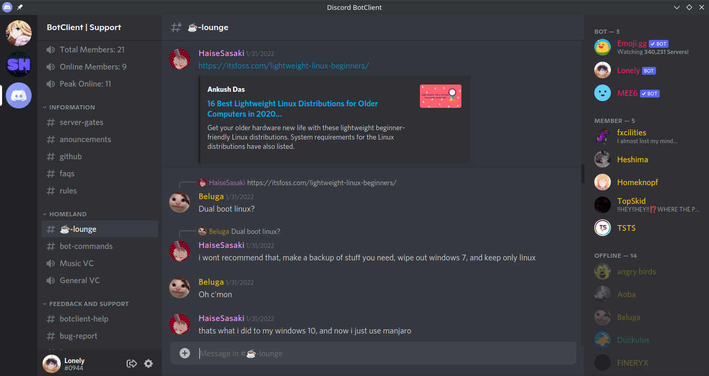
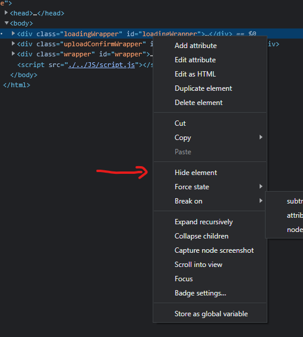

# BotClient Setup

This guide shows you how to get BotClient running on your Computer

## Prerequisites

-   [NodeJS](https://nodejs.org/en/download/)
-   [Git CLI](https://git-scm.com/downloads)

## Creating a Discord Bot

To run BotClient you need to have a Discord Bot with enabled privileged Intents. If you already have one you can skip this step.

1. Log into the [Discord Developer Portal](https://discord.com/developers)
2. Create a new application 
3. Inside your application go to Bot and create a new Bot. Click here to copy the bots token and save it somewhere. Don't share it with anyone! 
4. Now Scroll down a bit to the Privileged Intents Section and enable all 3 of them. Make sure to save afterwards! 

Congrats! Now you're done setting up your own Discord Bot!

## BotClient Setup Guide

First you need to clone the repository to your local Machine and move into it:

```
git clone https://github.com/DarkGuy10/BotClient.git
cd BotClient
```

Then you need to install the required Dependencies:

```
npm install
```

Now you can run the Client using:

```
npx electron .
```

Now a Window should open that prompts you to enter a token. Enter the Bot token that you saved earlier.

If everything worked you should be left with a window like this:


To get out of the loading screen, you currently need to hide it manually.
To do so, go into the dev windows at the right and locate the element called `<div class="loadingwrapper"...>`, Rightclick it and click on hide element.


### And that's it! Keep in mind that the Client is still in early Development. If you have any problems or questions about the Client feel free to join our [support server](https://discord.com/invite/aZSrxwNUFD) on Discord.
