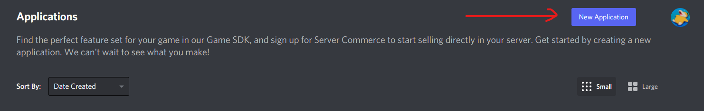
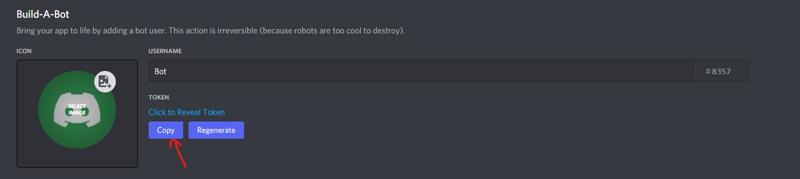
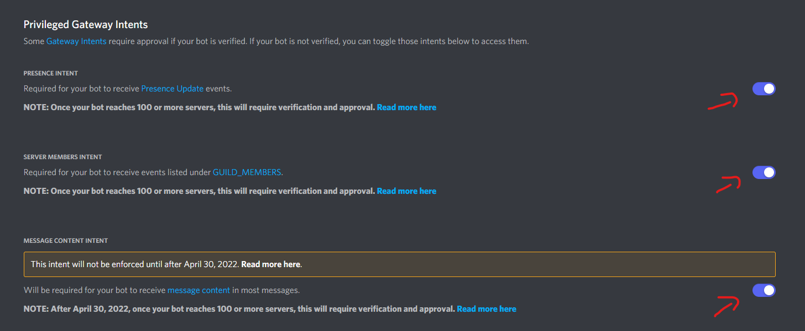
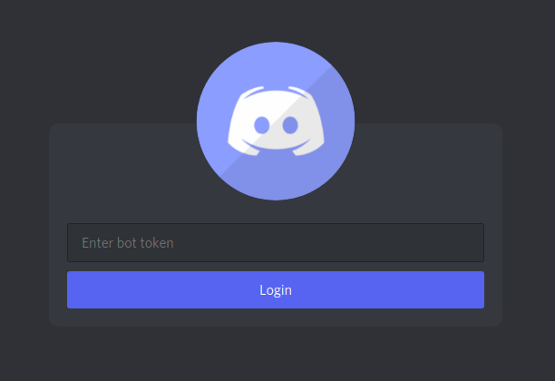

# BotClient Setup

This guide shows you how to get BotClient running on your Computer

## Prerequisites

-   [NodeJS](https://nodejs.org/en/download/)
-   [Yarn](https://classic.yarnpkg.com/lang/en/docs/install)
-   [Git CLI](https://git-scm.com/downloads)

## Creating a Discord Bot

To run BotClient you need to have a Discord Bot with **enabled privileged intents**. If you already have one you can skip this step.

1. Log into the [Discord Developer Portal](https://discord.com/developers)
2. Create a new application 
3. Inside your application go to Bot and create a new Bot. Click here to copy the bots token and save it somewhere. Don't share it with anyone! 
4. Now Scroll down a bit to the Privileged Intents Section and enable all 3 of them. Make sure to save afterwards! 

Congrats! Now you're done setting up your own Discord Bot!

## BotClient Setup Guide

First you need to clone the repository to your local machine and move into it:

```
git clone https://github.com/DarkGuy10/BotClient.git
cd BotClient
```

Then you need to install the required dependencies:

```
yarn add
```

Now you can run the Client using:

```
yarn start
```

Now a window should open that prompts you to enter a token. Enter the bot token that you saved earlier.


If everything worked properly, you should have successfully logged in!

You can logout using the button shown here\


### And that's it! Keep in mind that the Client is still in early development. If you have any problems or questions about the BotClient feel free to join our [support server](https://discord.com/invite/aZSrxwNUFD) on Discord.
